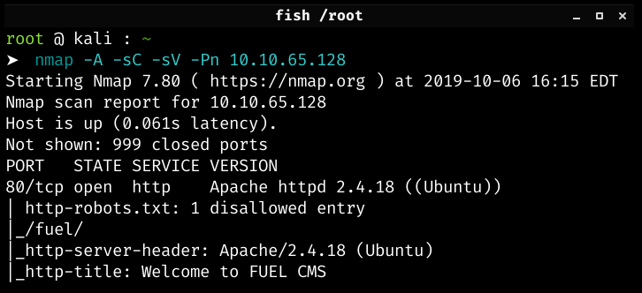
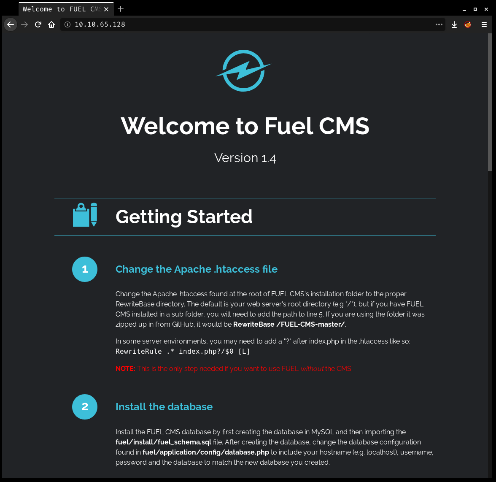
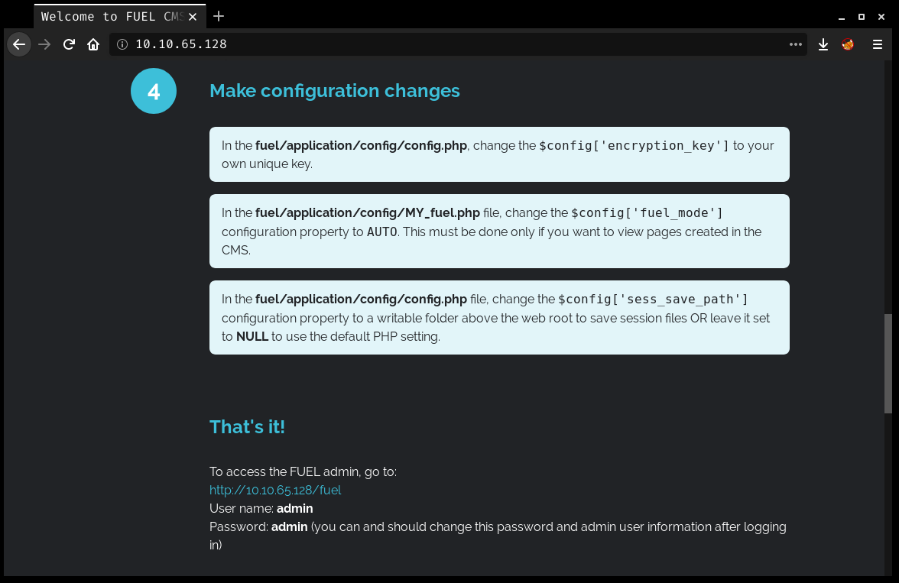
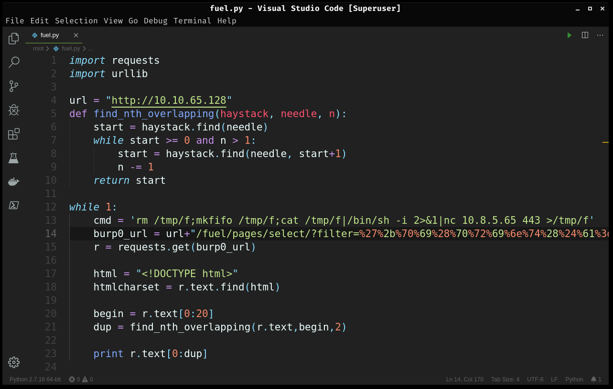
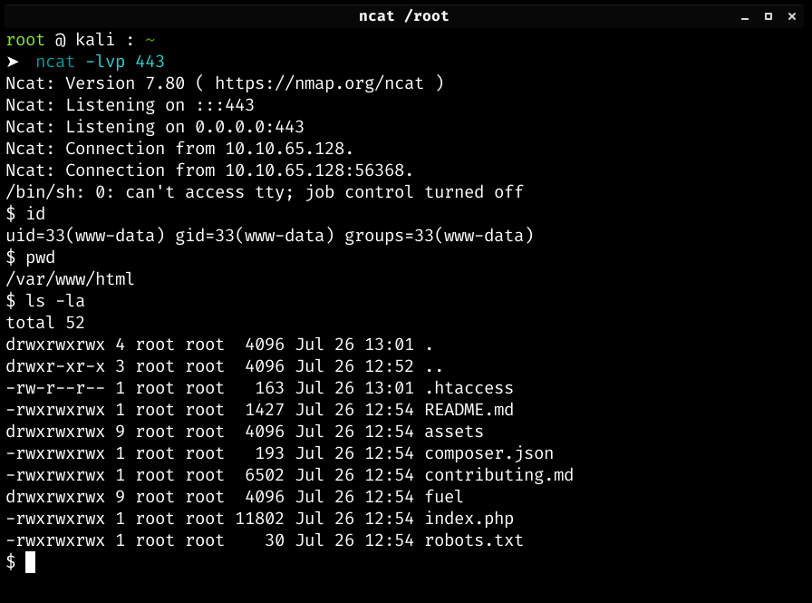
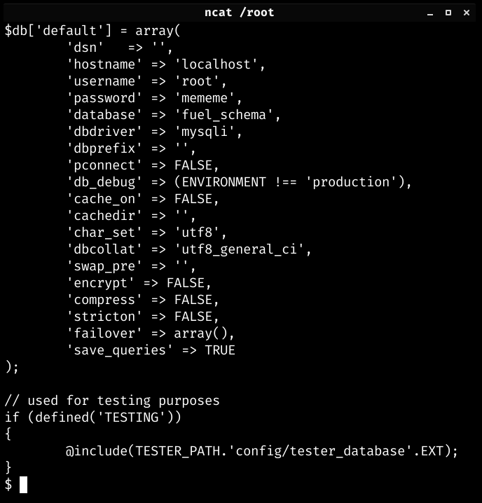

# Ignite

I started with a simple port scan which revealed only one port.

Nmap was kind enough to give use that one disallowed entry in the `robots.txt` file and the HTTP title gives away the used Content Management System. After visiting the website, I was presented with a lot mroe information. At first glance, I got the CMS version number and database configuration file location.

I scrolled down a little bit and I found the default admin credentials.

I logged in using the default credentials and tried to upload a PHP reverse shell. I might have done something wrong but I wasn't able to upload my file properly. Instead, I just searched for publicly available exploits for this specific CMS version. I found this: https://www.exploit-db.com/exploits/47138

I had to modify the source code a little bit in order to make the script work. I removed the proxy, changed the url variable and hardcoded a netcat reverse shell command instead of raw command input.

After I ran the script, I got a reverse shell connection on my listener as a low-privileged user `www-data`.

My manual enumeration did not yield anything useful. Then, I remembered that on the main page the database config file path was displayed, so I checked out the file. At the bottom, I found an array which contained the root password for the database.

